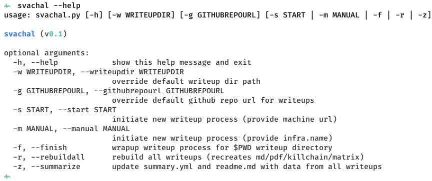
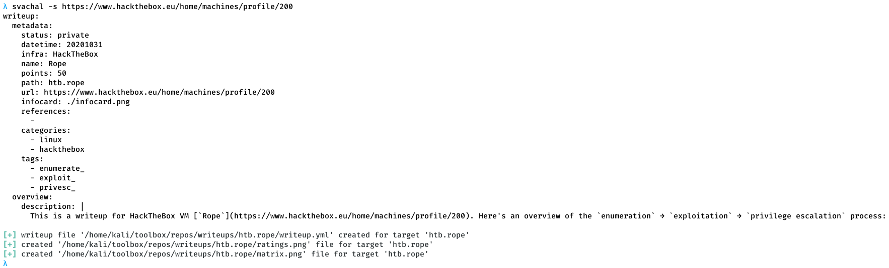
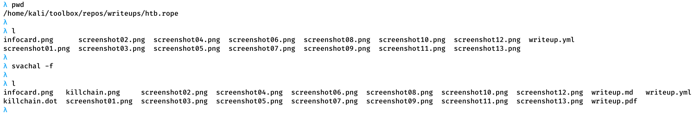
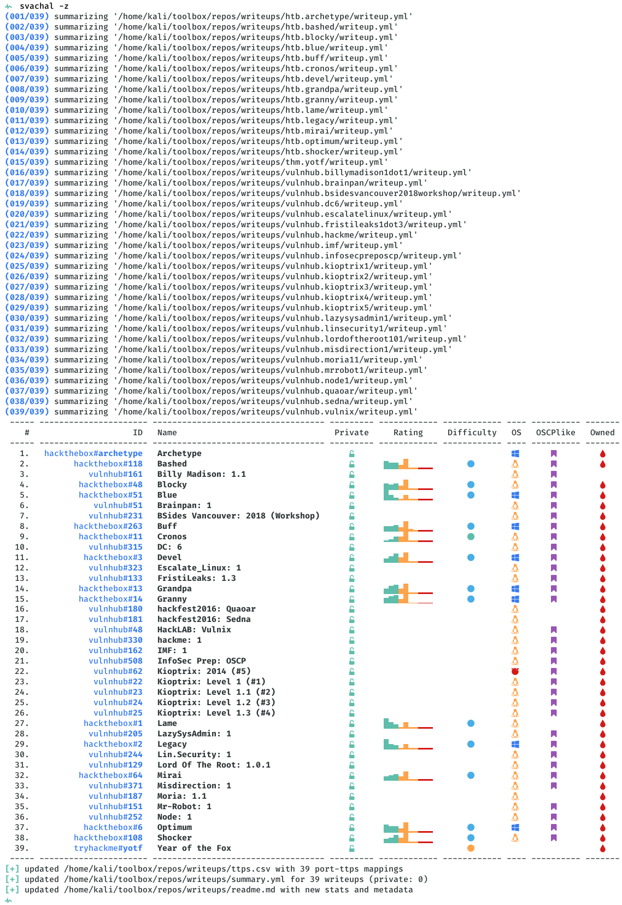

# svachal

[](https://creativecommons.org/licenses/by-sa/4.0/)

This is an automation framework for machine writeups. It defines a YAML based writeup template that can be used while working on a machine. Once the writeup is complete, the YAML writeup file can be used to render a `.md` and `.pdf` report alongwith stats and summary for all completed writeups. It works in conjuction with [machinescli](https://github.com/7h3rAm/machinescli) project, so all machine metadata is natively accessible:

## Install

You will need to configure machinescli before using svachal

To get your HTB_API_KEY go to your username tab > Classic HTB > Settings > API Key

```
mkdir -p Git/7h3rAm && cd Git/7h3rAm

python3 -m venv --copies venv

source venv/bin/activate

git clone https://github.com/7h3rAm/machinescli && cd machinescli

pip install -r requirements.txt

mkdir -p ~/toolbox/bootstrap

export HTB_API_KEY=srr5V1J6khMzGBaOmYOi97ckmQOiFlWh5ePzTcGvPqbvdEftJjba7thQpjF8

python3 machinescli.py --update

cd ..
```

Clone svachal repository, setup virtual environment and install requirements

```
git clone https://github.com/7h3rAm/svachal && cd svachal

pip install -r requirements.txt

python3 svachal.py -s https://www.hackthebox.eu/home/machines/profile/200
```

## Usage


## Usecases
1. Start a new writeup:


1. Finish a writeup:


1. Summarize all writeups:


1. Override default writeup directory and GitHub repo URL:
```console
$ svachal -w $HOME/<reponame> -g "https://github.com/<username>/<reponame>
```

## Summarized Writeup Graphs


## Argument Autocomplete
Source the `.bash-completion` file within a shell to trigger auto-complete for arguments. This will require the following alias (change path as needed): 
```console
alias svachal='python3 $HOME/svachal/svachal.py'
```

> You will need a [Nerd Fonts patched font](https://github.com/ryanoasis/nerd-fonts/tree/master/patched-fonts) for OS icons and other symbols to be rendered correctly.
