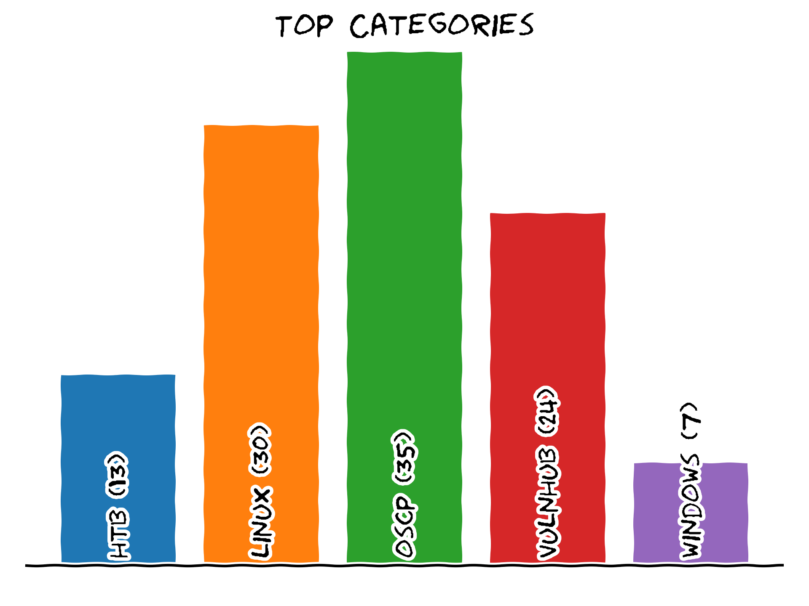
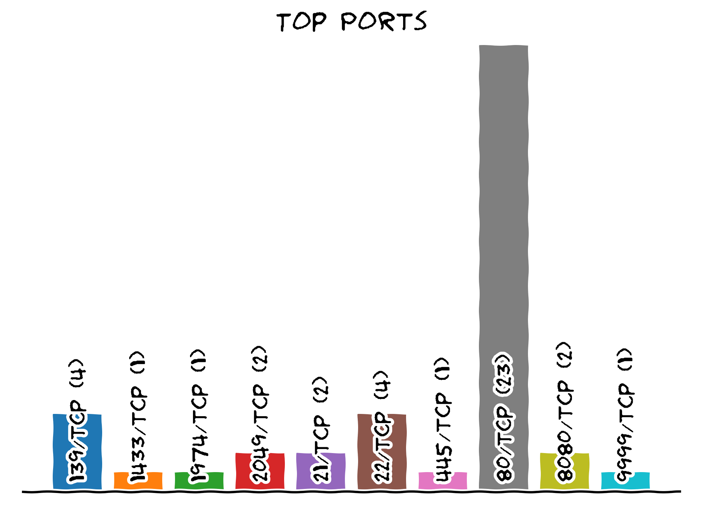
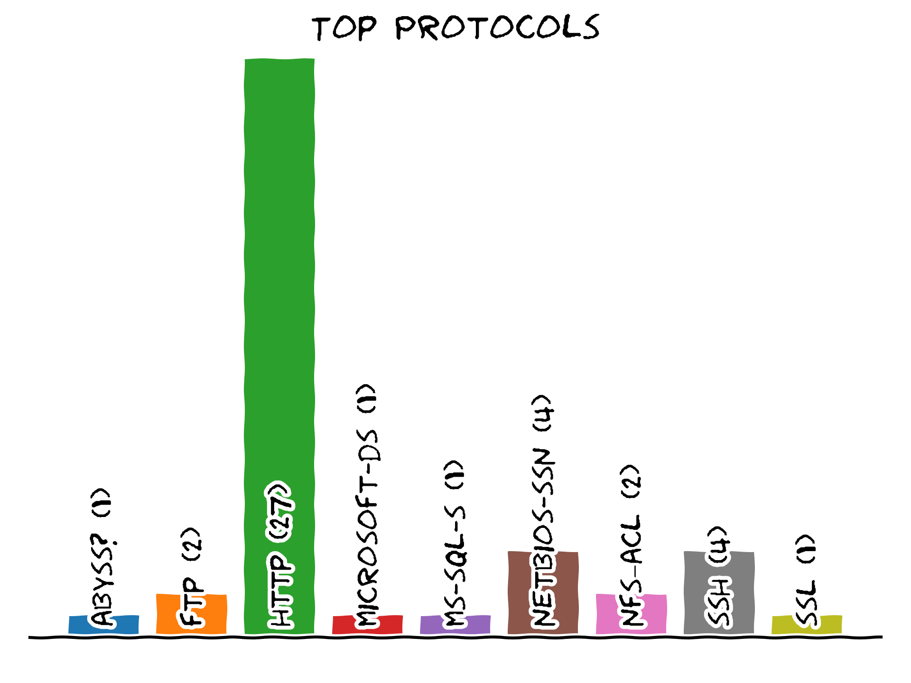
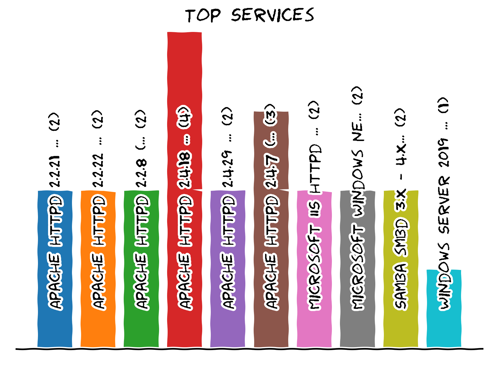
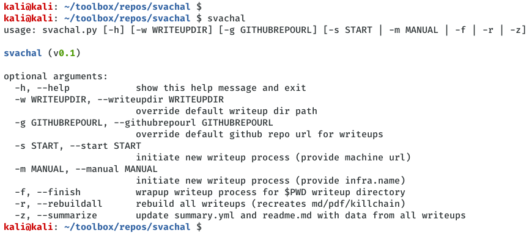
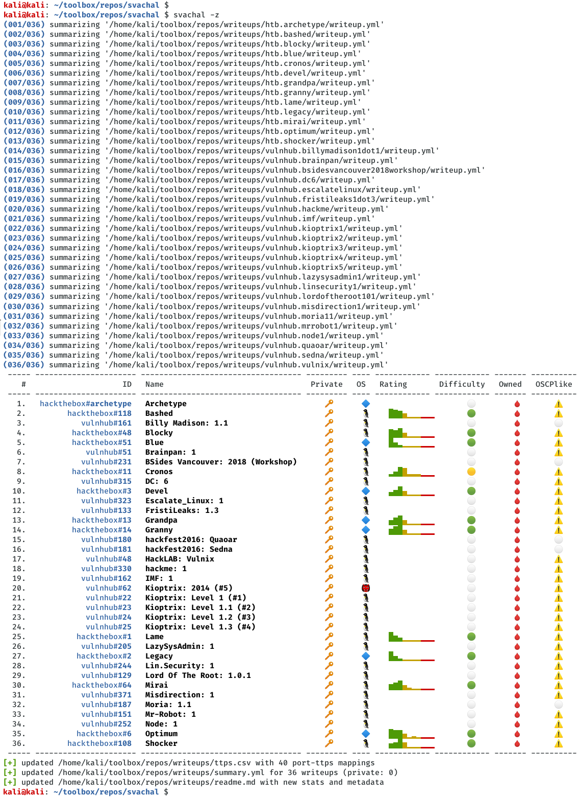

# svachal

[](https://creativecommons.org/licenses/by/4.0/)

This is an automation framework for machine writeups. It defines a YAML based writeup template that can be used while working on a HackTheBox/VulnHub machine. Once the writeup is complete, it can be used to generate a `.md` and `.pdf` report alongwith stats and summary for all completed writeups. It works in conjuction with [machinescli](https://github.com/7h3rAm/machinescli) project so all machine metadata is natively accessible during writeup process:

## Usage
```console
$ svachal 
usage: svachal.py [-h] [-w WRITEUPDIR] [-g GITHUBREPOURL] [-s START | -m MANUAL | -f | -r | -z]

svachal (v0.1)

optional arguments:
  -h, --help            show this help message and exit
  -w WRITEUPDIR, --writeupdir WRITEUPDIR
                        override default writeup dir path
  -g GITHUBREPOURL, --githubrepourl GITHUBREPOURL
                        override default github repo url for writeups
  -s START, --start START
                        initiate new writeup process (provide machine url)
  -m MANUAL, --manual MANUAL
                        initiate new writeup process (provide infra.name)
  -f, --finish          wrapup writeup process for $PWD writeup directory
  -r, --rebuildall      rebuild all writeups (recreates md/pdf/killchain)
  -z, --summarize       update summary.yml and readme.md with data from all writeups
```

## Usecases
1. Start a new writeup:
```console
$ python3 ./svachal.py -s https://www.hackthebox.eu/home/machines/profile/200
writeup:
  metadata:
    status: private
    datetime: 20200714
    infra: HackTheBox
    name: 'Rope'
    points: 50
    path: htb.rope
    url: https://www.hackthebox.eu/home/machines/profile/200
    infocard: ./infocard.png
    references:
      - 
    categories:
      - linux
      - hackthebox
    tags:
      - enumerate_
      - exploit_
      - privesc_
  overview:
    description: |
      This is a writeup for HackTheBox VM [`'Rope'`](https://www.hackthebox.eu/home/machines/profile/200). Here's an overview of the `enumeration` → `exploitation` → `privilege escalation` process:

[+] writeup file '/home/kali/toolbox/repos/writeups/htb.rope/writeup.yml' created for target 'htb.rope'
[+] created '/home/kali/toolbox/repos/writeups/htb.rope/ratings.png' file for target 'htb.rope'
[+] created '/home/kali/toolbox/repos/writeups/htb.rope/matrix.png' file for target 'htb.rope
```

2. Finish a writeup:
```console
$ cd <writeupdir>
$ python3 ./svachal.py -f
```

3. Summarize all writeups:
```console
$ python3 ./svachal.py -z
```

4. Rebuild all writeups:
```console
$ python3 ./svachal.py -r
```

5. Override default writeup directory and GitHub repo URL:
```console
$ python3 ./svachal.py -w $HOME/toolbox/repos/<reponame> -g "https://github.com/<username>/<reponame>
```

## Argument Autocomplete
There's a `.bash-completion` file that one can source within a shell to trigger auto-complete for arguments. This will, however, require an alias to work which can be created as follows:
```console
alias svachal='python3 $HOME/toolbox/repos/svachal/svachal.py'
```

## Summarized Writeups Graphs









## Screenshots




